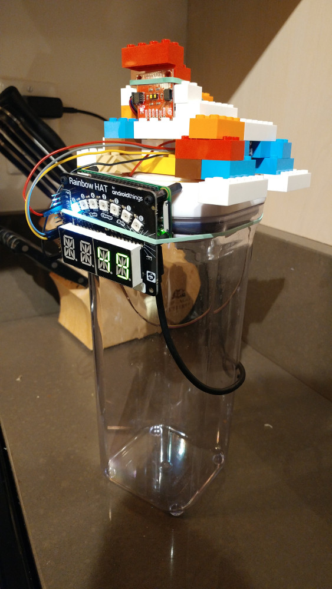

# DingPiesAreDone
A gesture-based kitchen timer for the Rasperry Pi


# Hardware
* https://www.raspberrypi.org/products/raspberry-pi-zero-w/
* https://github.com/pimoroni/rainbow-hat
* https://www.sparkfun.com/products/14722 (set the timer duration by putting hand various distances from the sensor)
* https://www.sparkfun.com/products/12787 (gesture based timer feature control)
* https://www.sparkfun.com/products/15794 (shim to connect Pi to distance sensor)
* https://www.sparkfun.com/products/15081 (wires to connect Pi to distance sensor)

## Setting up hardware
various wires - I soldered wires to the gensture sensor and connected them to the Pi. The gesture sensor has an interrupt pin but I couldn't figure out where to connect it to the Pi or what to do with it. The code seems to work fine without using it.

When I connected the Rainbow Hat to the GPIO pins there is a gap which is enough to put the Shim in there to connect to the distance sensor. However the gap is too wide to get a good connection so I forced a little bit of folded paper in the gap to put pressure on the shim. It's hacky.

## Setting up a Pi (in my case, a Pi Zero W)
in /boot/config.txt add:
* dtoverlay=pi3-disable-bt  <--if want to disable bluetooth
* dtparam=i2c_arm=on,i2c_baudrate=400000  

uncomment:
* dtparam=spi=on

run sudo raspi-config
* enable spi and i2c in interfacing options

apt-get install python3-venv python3-setuptools screen pimoroni python3-rainbowhat python-rpi.gpio python3-rpi.gpio

python3 -m venv venv

source venv/bin/activate

* pip install RPi.GPIO
* pip install smbus
* pip install rainbowhat
* pip install gevent
* pip install sparkfun-qwiic-vl53l1x
* pip install apds9960
* pip install sparkfun-qwiic  <-- 7/31/2020 404 error see https://github.com/sparkfun/Qwiic_Py/issues/5 I ended up cloning the git repo, deleting the affected dir, then doing an install
* pip install gevent

## Running it
source venv/bin/activate

python gesture.py

Note: my gesture sensor is mounted up-side down so the code will be reversed to what is written here

Up to 3 concurrent timers can be set. LEDs indicate how many are active and the time shown is for the one soonest to complete

* wave hand left->right = 1 minute time
* wave hand down->up = set timer based on distance sensor, then move hand 6" to 3' or so from the sensor to set the timer from 1 minute to 15 minutes. The true range depends on ambient conditions
* wave hand down->up = cancel current timer
* wave hand right->left = nothing set

### This one is a basic timer that uses the Rainbow Hat buttons
Can be used to diagnose problems since it uses the Rainbow Hat but not the other sensors

source venv/bin/activate

python driver.py

## if i2c is not set up correctly you will get this:

```(venv) pi@pizero:~/git/DingPiesAreDone/src $ python dingtimer.py
Traceback (most recent call last):
  File "dingtimer.py", line 4, in <module>
    import rainbowhat as rh
  File "/home/pi/venv/lib/python3.7/site-packages/rainbowhat/__init__.py", line 31, in <module>
    bus = smbus.SMBus(1)
FileNotFoundError: [Errno 2] No such file or directory
```

## This doesn't help you since I soldered these wires on
Wiring:
* black = gnd
* yellow = scl
* green = sdu
* red non-interrupt= 3v3
